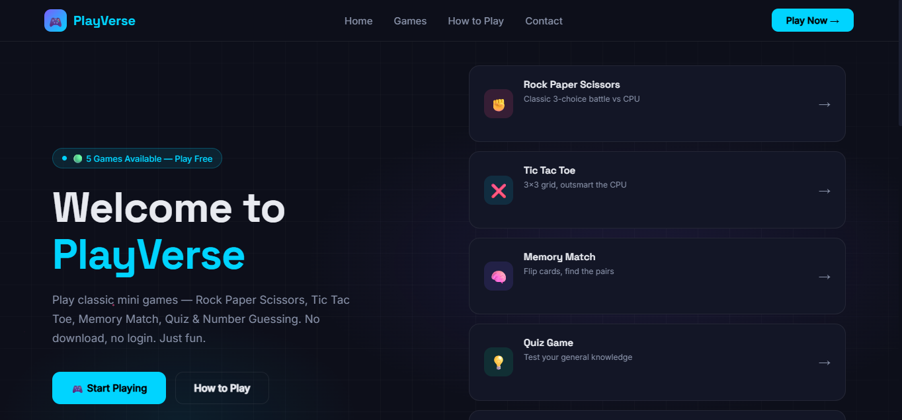
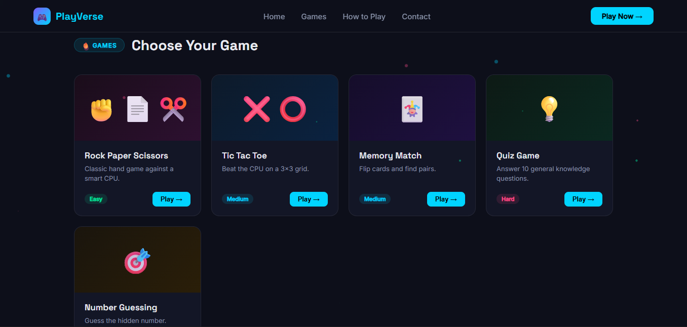

# 🎮 PlayVerse

<p align="center">
  
</p>

<p align="center">
  
  
  
</p>

---

## 🚀 Live Demo

👉 Play the project here: https://viveksingh002.github.io/playverse-proj/

---

## 📌 Overview

**PlayVerse** is a modern, interactive **browser-based mini-games arcade platform** built using pure **HTML, CSS, and JavaScript (ES6+)**.

It delivers a seamless and engaging gaming experience directly in the browser without requiring any installation, login, or external dependencies.

This project was developed with a strong focus on enhancing core frontend engineering skills, including:

- Advanced DOM manipulation and dynamic UI rendering
- Interactive game logic architecture and state management
- Modern UI/UX design principles with responsive layouts
- Event-driven programming and real-time user interactions

This project demonstrates how multiple independent games can be efficiently integrated into a single cohesive, high-performance web application without using any frameworks or libraries.

---

## ✨ Features

- 🎮 Multiple mini games in one platform
- ⚡ Lightweight & fast performance
- 📱 Fully responsive (mobile + desktop)
- 🎨 Modern dark UI with smooth animations
- 🧠 Logic-based interactive gameplay
- 🔁 Instant restart / replay system
- 🌐 Fully deployed on GitHub Pages

---

## 🕹️ Games Included

| Game                    | Description                    |
| ----------------------- | ------------------------------ |
| ✊ Rock Paper Scissors  | Play against computer AI       |
| ❌ Tic Tac Toe          | Classic 2-player strategy game |
| 🧠 Memory Match Game    | Flip and match cards           |
| 💡 Quiz Game            | Random questions with timer    |
| 🎯 Number Guessing Game | Guess hidden number with hints |

---

## 🛠️ Tech Stack

- **HTML5** – Semantic structure for building accessible and well-organized web interfaces
- **CSS3** – Modern styling with Flexbox, CSS Grid, animations, and responsive design principles
- **JavaScript (ES6+)** – Core game logic, DOM manipulation, and interactive user experience handling
- **Responsive Web Design** – Fully optimized for mobile, tablet, and desktop devices
- **UI/UX Design Principles** – Focused on clean layout, intuitive navigation, and engaging user interaction
- **Git & GitHub** – Version control, collaboration workflow, and project deployment using GitHub Pages

## 📂 Project Structure

```bash
playverse-proj/
│── index.html
│── style.css
│── script.js
│── assets/
│   ├── screenshot1.png
│   ├── screenshot2.png
│── README.md
```

## 📸 Preview

<p align="center">
  
</p>
<p align="center">
  
</p>

## 💡 Key Learnings

* Building real-world JavaScript logic
* Handling multiple game states
* Improving UI/UX with CSS animations
* Structuring a multi-feature project
* GitHub deployment workflow

---

## 🚀 Future Improvements

* 🏆 Leaderboard system (local storage)
* 🔊 Sound effects & haptics
* 🤖 AI-based quiz generation
* 🌙 Dark/Light mode toggle
* 🧑 Multiplayer mode
* 📊 Score analytics dashboard

---

## 👨‍💻 Author

**Vivek Singh**

💻 Aspiring Full Stack Developer

🚀 Building real-world frontend projects

---


## ⭐ Support

If you like this project, consider supporting it:

- ⭐ Star this repository
- 🍴 Fork and improve it
- 🚀 Share with others

It really helps motivation 💙
